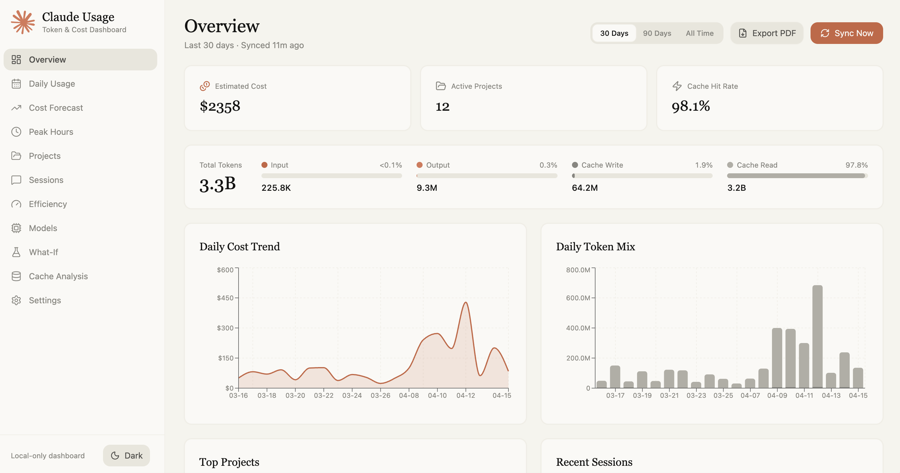
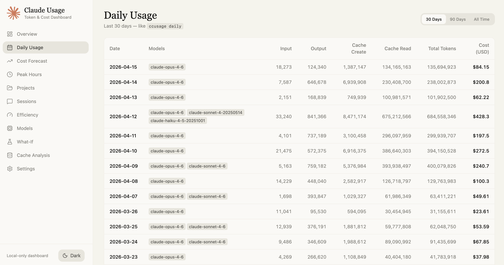
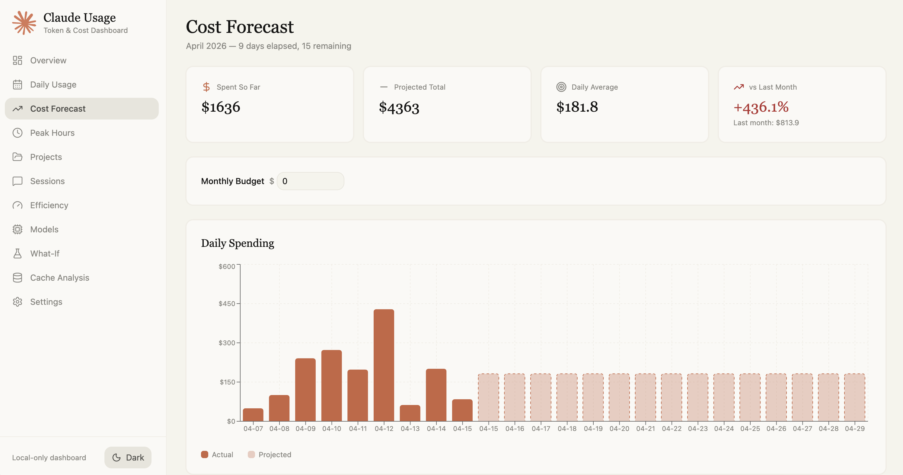
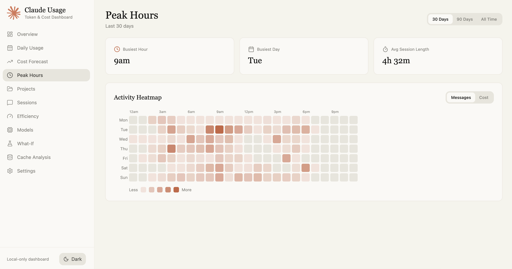
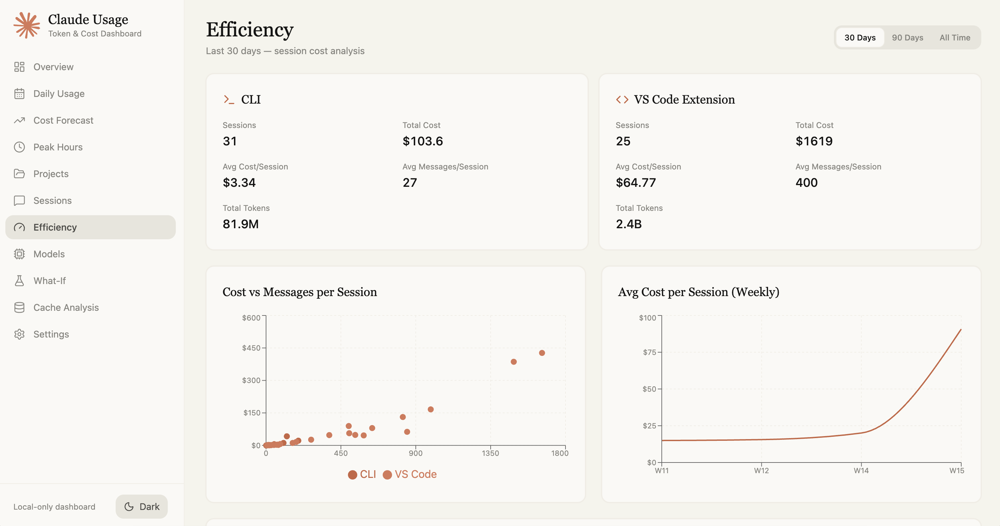
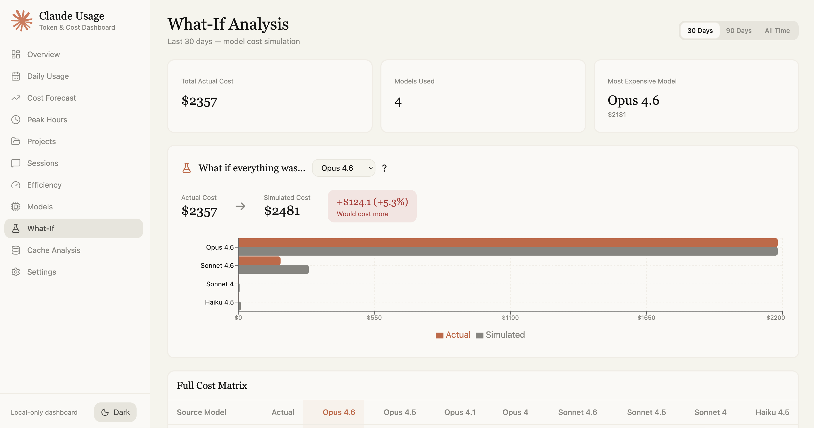
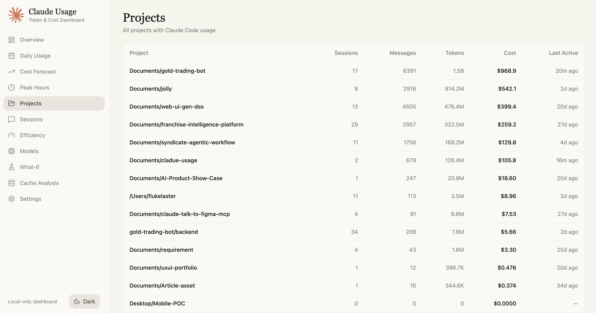
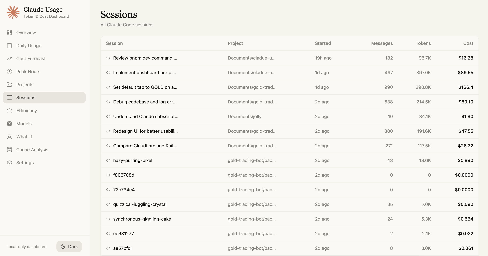
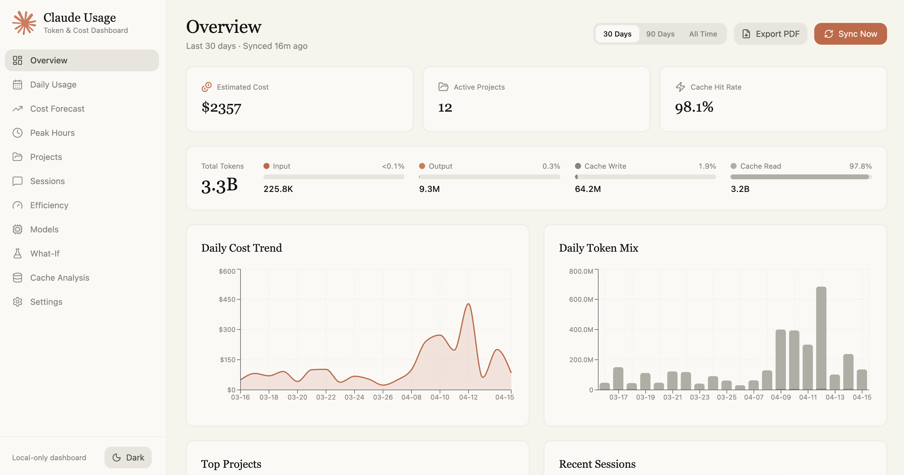
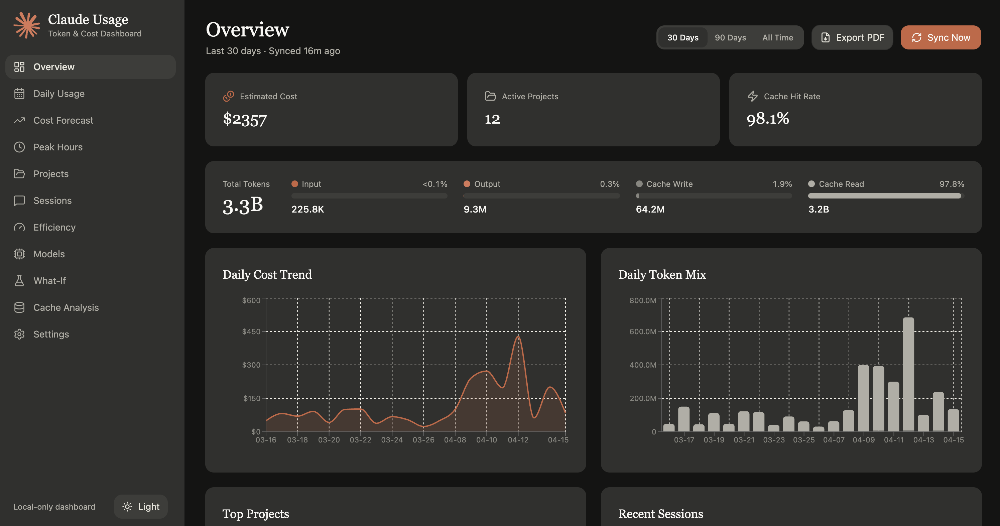

<p align="center">
  
</p>

<h1 align="center">Claude Usage Dashboard</h1>

<p align="center">
  Local dashboard for visualizing token usage and estimated costs from <a href="https://claude.ai/code">Claude Code</a> session logs.
</p>

<p align="center">
  
  
  
  
</p>

> **Note:** This dashboard reads local Claude Code logs from `~/.claude/projects/`. It does NOT access the Anthropic API — all data comes from your local filesystem. Costs shown are **estimated equivalent API costs**, not actual charges (especially relevant for Claude Max subscribers).

---

## Screenshots

### Overview

KPI cards, daily cost/token charts, top projects, and recent sessions at a glance.



### Daily Usage

Detailed daily breakdown with per-model badges, token columns, and totals — like running `ccusage daily` but in your browser.



### Cost Forecast

Current month spend, projected end-of-month cost, burn rate trend, and optional budget tracking with visual progress bar.



### Peak Hours

GitHub-style activity heatmap (day-of-week x hour) showing when you use Claude the most. Toggle between message count and cost view.



### Session Efficiency

CLI vs VS Code comparison, scatter plot of cost vs messages, weekly cost trend, and sessions ranked by cost-per-message.



### What-If Analysis

"What if everything was Haiku?" — model cost simulator with side-by-side comparison, savings indicator, and full cross-model cost matrix.



### Projects & Sessions

Per-project breakdown and per-session message timeline with token details.

| Projects | Session Detail |
|----------|---------------|
|  |  |

### Dark Mode

Full dark theme following Anthropic's warm-toned design system.

| Light | Dark |
|-------|------|
|  |  |

---

## Features

- **Overview** — KPI cards, daily cost trend, token breakdown, top projects
- **Daily Usage** — Day-by-day table with model badges and totals (like `ccusage daily`)
- **Cost Forecast** — Projected monthly cost, burn rate trend, budget tracking
- **Peak Hours** — Activity heatmap by hour and day of week
- **Efficiency** — CLI vs VS Code comparison, cost-per-message ranking, scatter charts
- **What-If** — Model cost simulator with full cross-model pricing matrix
- **Projects** — Per-project breakdown with cost, sessions, model usage
- **Sessions** — Session list with drill-down to per-message timeline
- **Models** — Compare usage across Opus, Sonnet, Haiku with daily trend
- **Cache Analysis** — Cache hit rate, savings/overhead, per-project efficiency
- **Dark Mode** — Toggle between light and dark themes
- **PDF Export** — Download reports as PDF
- **Period Filter** — Switch between 30 days, 90 days, or all time

---

## Quick Start

```bash
# Clone
git clone https://github.com/flukelaster/claude-usage.git
cd claude-usage

# Install dependencies
pnpm install

# Sync Claude Code logs into local SQLite cache
pnpm sync

# Start dev server
pnpm dev
```

Open **http://localhost:3000** and click **Sync Now** to import your latest logs.

### Requirements

- **Node.js** 20+
- **pnpm** 9+
- **Claude Code** installed and used (generates logs at `~/.claude/projects/`)

### Platform Support

Works on **macOS**, **Linux**, and **Windows**.

On Windows, `better-sqlite3` requires native build tools. If `pnpm install` fails:

```powershell
npm install -g windows-build-tools
# or install "Desktop development with C++" workload via Visual Studio Installer
```

---

## How It Works

```
~/.claude/projects/**/*.jsonl  →  Stream Parser  →  SQLite Cache  →  Dashboard
```

1. **Parser** reads `.jsonl` session files from `~/.claude/projects/`
2. Extracts token usage from `assistant` entries (input, output, cache write, cache read)
3. Calculates estimated costs using [Anthropic's published pricing](https://docs.anthropic.com/en/docs/about-claude/pricing)
4. Stores parsed data in a local SQLite database (`data/cache.db`, gitignored)
5. Dashboard queries SQLite via TanStack Start server functions
6. **Incremental sync** — only parses new data since last sync (tracks byte offsets)

---

## Supported Models & Pricing

| Model | Input | Output | Cache Write (5m) | Cache Write (1h) | Cache Read |
|---|---|---|---|---|---|
| Opus 4.6 | $5/MTok | $25/MTok | $6.25/MTok | $10/MTok | $0.50/MTok |
| Opus 4.5 | $5/MTok | $25/MTok | $6.25/MTok | $10/MTok | $0.50/MTok |
| Sonnet 4.6 | $3/MTok | $15/MTok | $3.75/MTok | $6/MTok | $0.30/MTok |
| Sonnet 4 | $3/MTok | $15/MTok | $3.75/MTok | $6/MTok | $0.30/MTok |
| Haiku 4.5 | $1/MTok | $5/MTok | $1.25/MTok | $2/MTok | $0.10/MTok |

Pricing verified 2026-04-14. Dashboard warns if pricing data is >90 days old.

---

## Tech Stack

- [TanStack Start](https://tanstack.com/start) — Vite + SSR + Server Functions
- [TanStack Router](https://tanstack.com/router) — File-based routing
- [TanStack Query](https://tanstack.com/query) — Data fetching + caching
- [Recharts](https://recharts.org/) — Charts
- [better-sqlite3](https://github.com/WiseLibs/better-sqlite3) + [Drizzle ORM](https://orm.drizzle.team/) — Database
- [Tailwind CSS v4](https://tailwindcss.com/) — Styling
- [Lucide React](https://lucide.dev/) — Icons

## Scripts

| Command | Description |
|---|---|
| `pnpm dev` | Start dev server with hot reload |
| `pnpm build` | Build for production |
| `pnpm start` | Start production server |
| `pnpm sync` | Sync Claude Code logs (CLI, no server needed) |

---

## Privacy

- **No message content** is stored — only token counts and metadata
- All data stays on your local machine
- The SQLite cache (`data/cache.db`) is gitignored
- No network requests except to `localhost`

## License

MIT
